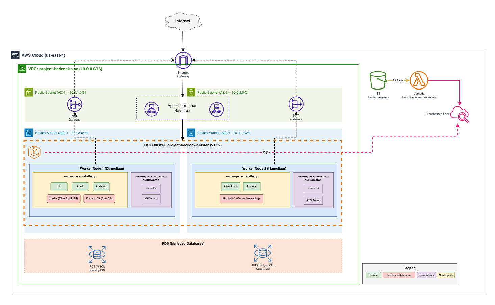

# Project Bedrock

A production-ready EKS infrastructure hosting the AWS Retail Store Sample Application with managed databases, serverless processing, and CI/CD automation.

## Architecture



### Components

| Layer | Resources |
|-------|-----------|
| **Networking** | VPC with public/private subnets across 2 AZs, NAT Gateway, Internet Gateway |
| **Compute** | EKS cluster (v1.34) with 2x t3.medium managed nodes |
| **Data** | RDS MySQL (Catalog), RDS PostgreSQL (Orders), DynamoDB (Cart), Redis (Checkout) |
| **Ingress** | AWS Load Balancer Controller, ALB with HTTPS/TLS via ACM |
| **Secrets** | AWS Secrets Manager + External Secrets Operator |
| **Serverless** | S3 bucket triggers Lambda for asset processing |
| **Observability** | CloudWatch for control plane logs and container logs |

## Deployment Guide

### Prerequisites

- AWS CLI configured with appropriate credentials
- Terraform >= 1.13
- kubectl
- Helm >= 3.14

### Triggering the Pipeline

The CI/CD pipeline is configured via GitHub Actions:

1. **On Pull Request to `main`**: Runs `terraform plan` to preview infrastructure changes
2. **On Merge to `main`**: Runs `terraform apply` and deploys the application to EKS

To trigger:
```bash
# Create a branch and make changes
git checkout -b feature/my-change

# Push and create a PR
git push -u origin feature/my-change
# Open PR on GitHub - this triggers terraform plan

# Merge the PR - this triggers terraform apply + k8s deployment
```

### Manual Deployment

```bash
# 1. Initialize and apply Terraform
cd terraform
terraform init
terraform apply

# 2. Configure kubectl
aws eks update-kubeconfig --name project-bedrock-cluster --region us-east-1

# 3. Deploy External Secrets Operator
./scripts/setup-eso.sh

# 4. Deploy Retail Store Application
./scripts/deploy-retail-app-rds.sh

# 5. Setup ALB Controller and Ingress
./scripts/setup-alb-controller.sh
```

## Accessing the Application

| Method | URL |
|--------|-----|
| **HTTPS (Primary)** | https://myprojectbedrock.xyz |
| **HTTPS (WWW)** | https://www.myprojectbedrock.xyz |

## Project Structure

```
project-bedrock/
├── terraform/           # Infrastructure as Code
│   ├── vpc.tf          # VPC, subnets, NAT, IGW
│   ├── eks.tf          # EKS cluster and node group
│   ├── rds.tf          # MySQL and PostgreSQL databases
│   ├── s3.tf           # Assets bucket with Lambda trigger
│   ├── lambda.tf       # Asset processor function
│   ├── iam.tf          # Developer user and RBAC
│   ├── acm.tf          # SSL/TLS certificate
│   └── ...
├── kubernetes/          # Kubernetes manifests
│   ├── catalog-values.yaml
│   ├── orders-values.yaml
│   ├── ingress.yaml
│   └── ...
├── scripts/             # Deployment scripts
│   ├── setup-eso.sh
│   ├── deploy-retail-app-rds.sh
│   └── setup-alb-controller.sh
├── lambda/              # Lambda function code
│   └── index.py
└── .github/workflows/   # CI/CD pipeline
    └── terraform.yaml
```

## Security

### Developer Access (bedrock-dev-view)

The `bedrock-dev-view` IAM user has:
- **AWS Console**: ReadOnly access to view resources
- **S3**: PutObject permission for the assets bucket
- **Kubernetes**: View-only access to the `retail-app` namespace

### Secrets Management

Database credentials are stored in AWS Secrets Manager and synced to Kubernetes via External Secrets Operator (ESO).

## Testing the Lambda Trigger

```bash
# Upload a file to the assets bucket
aws s3 cp test-file.txt s3://project-bedrock-assets/test-file.txt

# Check Lambda logs in CloudWatch
aws logs tail /aws/lambda/bedrock-asset-processor --follow
```